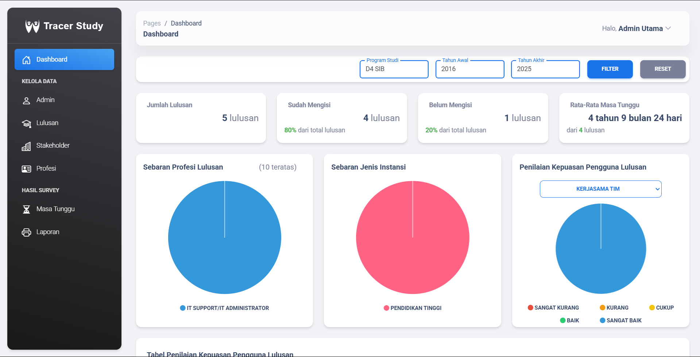

Tracer Study Website 🌟
 
A Laravel-powered web app to track and manage alumni data for educational institutions. Keep tabs on your alumni with a sleek interface and robust backend! 🚀
✨ Features

📋 Alumni Data: Add, edit, and view alumni records effortlessly.
🔐 Secure Access: Role-based login for admins and users.
📊 Dashboards: Visualize alumni insights at a glance.
📥 CSV Support: Import/export data with ease (where implemented).
📱 Responsive: Works on desktops, tablets, or phones.

🛠️ Tech Stack

Component
Technology
Purpose
Link

Backend
Laravel 10.x, PHP 8.2+
Core framework and logic
Laravel Docs

Database
MySQL (via phpMyAdmin)
Data storage
phpMyAdmin

Frontend
Bootstrap 5, JavaScript, Vite
UI and asset build
Bootstrap

Server
Laragon or artisan serve
Local dev server
Laragon

Tools
Composer, npm
Dependency management
Composer

🎯 Getting Started
Prerequisites

🖥️ PHP 8.2+
📦 Composer
🌐 Node.js (for assets)
🗄️ MySQL (via phpMyAdmin)
🛠️ Laragon (optional for easy setup)

Installation

Click to expand setup steps

Clone the Repo:
git clone https://github.com/Huseinfa/Tracer-Study.git
cd Tracer-Study

Install Dependencies:
composer install
npm install

Configure Environment:

Copy .env.example to .env:cp .env.example .env

Edit .env for database/mail:DB_CONNECTION=mysql
DB_HOST=127.0.0.1
DB_PORT=3306
DB_DATABASE=tracer_study
DB_USERNAME=root
DB_PASSWORD=

Generate Key:
php artisan key:generate

Run Migrations:
php artisan migrate

Build Assets:
npm run dev

Start Server:

Laragon: Add project to Laragon, access via http://tracer-study.test.
Artisan:php artisan serve

Visit http://localhost:8000.

📸 Screenshot
.
🖱️ Usage

🌐 Open http://localhost:8000 (or Laragon URL).
🔑 Log in as admin (use seeded credentials or register).
📋 Manage alumni via the dashboard.
⚠️ Check storage/logs/laravel.log for issues.

🤝 Contributing
Want to help? Great! 🙌

Fork the repo.
Create a branch (git checkout -b feature/your-feature).
Commit changes (git commit -m "Add feature").
Push (git push origin feature/your-feature).
Open a pull request.

Follow Laravel’s coding standards and add clear comments.
📜 License
Licensed under the MIT License.
📬 Contact
Got questions? Open a GitHub issue or use the discussion tab.
